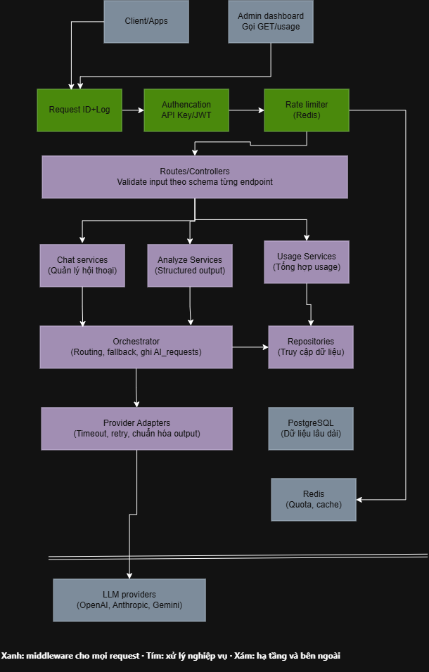
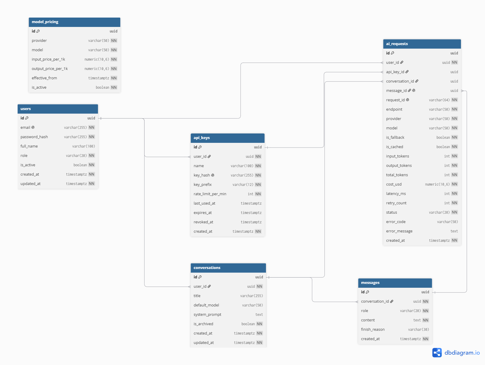

# AI Gateway

A production-ready central backend service positioned between internal applications and LLM providers. Applications call the gateway instead of calling LLM providers directly; the gateway handles authentication, rate limiting, provider routing with automatic fallback, exponential backoff retries, JSON structured output parsing with repair attempts, persistent conversation storage, per-request usage logging, and aggregate usage analytics.

## Links

- **Live Deployed API**: [https://api-gateway-production-3321.up.railway.app](https://api-gateway-production-3321.up.railway.app)
- **Live API Docs (Swagger UI)**: [https://api-gateway-production-3321.up.railway.app/docs](https://api-gateway-production-3321.up.railway.app/docs)
- **Postman Collection & Environment**: [docs/postman/](docs/postman/) ([collection.json](docs/postman/collection.json), [environment.json](docs/postman/environment.json))
- **Demo Video**: [Demo Video Placeholder](https://api-gateway-production-3321.up.railway.app/docs)

---

## Quick Start

### Local Prerequisites

- Node.js 24 LTS
- Docker Desktop (for Postgres 16 & Redis 7)

### Local Development Setup

1. **Install Dependencies**:

   ```bash
   npm ci
   ```

2. **Start Infrastructure Services**:

   ```bash
   docker compose up -d db redis
   ```

3. **Run Database Migrations**:

   ```bash
   npm run migrate
   ```

4. **Start Application (Dev Mode with Auto-Reload)**:

   ```bash
   npm run dev
   ```

5. **Run Automated Test Suite**:

   ```bash
   npm test
   ```

6. **Lint and Format Check**:
   ```bash
   npm run lint
   npm run format:check
   ```

---

## Architecture

See full details in [docs/architecture.md](docs/architecture.md).



### Core Components & Layering

| Directory           | Layer / Purpose   | Responsibilities                                                                                                                                    |
| :------------------ | :---------------- | :-------------------------------------------------------------------------------------------------------------------------------------------------- |
| `src/config/`       | Configuration     | Environment validation via Zod (`env.js`)                                                                                                           |
| `src/core/`         | Core Utilities    | Logger (pino), JWT (jsonwebtoken HS256), Password (bcryptjs), API key hashing (SHA-256), Time helpers                                               |
| `src/infra/`        | Infrastructure    | PostgreSQL pool (`db.js`), ioredis client (`redis.js`), health checks                                                                               |
| `src/middleware/`   | Middleware        | Request ID (`pino-http`), Auth (JWT / API Key), Rate Limit (fixed window Lua), Validation, Error handler                                            |
| `src/routes/`       | HTTP Routes       | Route mapping and HTTP response rendering (`/health`, `/v1/auth`, `/v1/api-keys`, `/v1/ai`, `/v1/conversations`, `/v1/usage`)                       |
| `src/services/`     | Business Services | Business logic (`auth`, `api-key`, `chat`, `analyze`, `conversation`, `usage`)                                                                      |
| `src/llm/`          | LLM Core          | Provider base class, Gemini/Groq adapters (`openai` SDK), Retry backoff (`retry.js`), Cost calculator (`cost.js`), Orchestrator (`orchestrator.js`) |
| `src/repositories/` | Data Access       | Raw SQL queries with parameterized inputs (`$1, $2`) — `user`, `api-key`, `conversation`, `message`, `ai-request`, `model-pricing`                  |
| `src/schemas/`      | Validation        | Zod request, response, and query validation schemas                                                                                                 |
| `src/openapi/`      | API Specs         | Zod-to-OpenAPI registry and Swagger UI integration                                                                                                  |

### Request Flow Summary

1. Client issues HTTP request to gateway endpoint.
2. `requestIdMiddleware` assigns or reuses `X-Request-ID`.
3. `authMiddleware` validates JWT (`Bearer <token>`) or API Key (`X-API-Key`), attaching caller details to request.
4. `rateLimitMiddleware` evaluates current minute window in Redis.
5. Router calls appropriate Service layer.
6. Service calls Orchestrator (`executeAIRequest`), which attempts primary provider adapter.
7. On 5xx, timeout, or 429 errors, `retry.js` retries primary provider up to 2 times with exponential backoff & jitter.
8. If primary retries fail or return `client_error` (401/404), Orchestrator switches to fallback provider (`is_fallback = true`).
9. On success or failure, Orchestrator writes exactly 1 audit row into `ai_requests` PostgreSQL table.
10. Response is serialized to JSON and sent to client with `X-Request-ID` and rate limit headers.

---

## API Design

See [docs/api-design.md](docs/api-design.md) and [docs/error-codes.md](docs/error-codes.md).

### Endpoint Overview

| Method   | Endpoint                 | Auth      | Description                                                    |
| :------- | :----------------------- | :-------- | :------------------------------------------------------------- |
| `GET`    | `/`                      | None      | Service info (`name`, `version`, `docs`, `health`)             |
| `GET`    | `/health`                | None      | Dependency health (`db`, `redis`, `schema`)                    |
| `POST`   | `/v1/auth/register`      | None      | Register new user account                                      |
| `POST`   | `/v1/auth/login`         | None      | User authentication returning JWT bearer token                 |
| `GET`    | `/v1/auth/me`            | JWT / Key | Get current authenticated user profile                         |
| `POST`   | `/v1/api-keys`           | JWT Only  | Create new API key (returns raw key once)                      |
| `GET`    | `/v1/api-keys`           | JWT Only  | List caller's API keys (hashed, prefix shown)                  |
| `DELETE` | `/v1/api-keys/{id}`      | JWT Only  | Revoke an API key                                              |
| `POST`   | `/v1/ai/chat`            | JWT / Key | Multi-turn chat completion with prompt history                 |
| `POST`   | `/v1/ai/analyze`         | JWT / Key | Structured text analysis (`sentiment`, `summarize`, `extract`) |
| `GET`    | `/v1/conversations`      | JWT / Key | List user's conversations (paginated)                          |
| `GET`    | `/v1/conversations/{id}` | JWT / Key | Get detailed conversation message history                      |
| `GET`    | `/v1/usage`              | JWT / Key | Usage metrics summary and per-model breakdown                  |

### Auth Model & Permissions

- **JWT Authentication**: User login returns an HS256 signed JWT (`algorithms: ['HS256']`). JWT callers can manage API keys, start chats, run text analysis, view conversations, and inspect usage.
- **API Key Authentication**: API keys (`gw_*`) are stored as SHA-256 hashes (`node:crypto`). API keys can call `/v1/ai/*`, `/v1/conversations*`, and `/v1/usage`, but calling `/v1/api-keys*` returns `403 FORBIDDEN`.
- **Resource Ownership**: Users can only access their own resources (conversations, keys, usage). Accessing another user's conversation returns `404 NOT_FOUND`. `GET /v1/usage?user_id=` filtering is restricted to `admin` roles (non-admins receive `403 FORBIDDEN`).

---

## Database

See [docs/database.md](docs/database.md) and generated schema dump [docs/schema.sql](docs/schema.sql).



### Key Design Decisions

- **Raw Parameterized SQL Only**: Executed via PostgreSQL `pg` pool in `src/repositories/` using `$1, $2` placeholders to eliminate SQL injection risks.
- **Generated Computed Column**: `ai_requests.total_tokens` is defined as `GENERATED ALWAYS AS (input_tokens + output_tokens) STORED`.
- **Chat Transaction Safety**: In `/v1/ai/chat`, user messages are inserted inside a database transaction _before_ calling the LLM orchestrator. If the LLM provider fails post-save, the error response includes `conversation_id` in `error.details` so callers can retry within the same conversation context.

---

## AI Integration

- **Providers & Adapters**: Integrates with OpenAI-compatible endpoints (`gemini` and `groq`) using the official `openai` Node.js SDK wrapped inside specialized adapters (`gemini.adapter.js`, `groq.adapter.js`).
- **Reliability Settings**:
  - `PROVIDER_TIMEOUT_MS`: 30,000 ms timeout per provider call (`maxRetries: 0` set on `OpenAI` client instance).
  - `PROVIDER_MAX_RETRIES`: Up to 2 retries with exponential backoff & jitter for 5xx, 429, connection errors, and timeouts.
  - **Client Errors & Fallback**: HTTP 401/404 errors on primary provider skip retries and trigger fallback provider immediately (`is_fallback = true`).
- **Structured Output & Repair Attempts**: Task prompts (`sentiment`, `summarize`, `extract`) request JSON output matching Zod schemas. If the initial response fails Zod validation, exactly one repair call is made appending the validation error message. Tokens from both calls are summed, and a single `ai_requests` row is logged.
- **Cost Calculation**: Calculated dynamically from `model_pricing` repository rows (`input_price_per_1k` and `output_price_per_1k`).

---
## Error handling strategy

**One error format everywhere.** Every error from every endpoint returns
`{ "error": { "code", "message", "request_id", "details" } }`. `code` is stable for
programs, `message` is for people. Full list: [docs/error-codes.md](docs/error-codes.md).

**Traceable by request_id.** Every response carries `X-Request-ID`. Every 5xx is logged
at error level with `request_id`, code, method, path and stack trace, so a failing request
can be found in the logs from the id the client received. Stack traces are never returned.

**No information leaks.** Invalid, revoked or expired credentials all return the same 401.
Another user's resource returns 404, not 403. Provider error bodies are never forwarded
to clients; at most 500 characters are stored in `ai_requests.error_message`.

**Provider failures (in order).**
1. Timeout per call (`PROVIDER_TIMEOUT_MS`, 30 s); SDK retries disabled.
2. Retry up to `PROVIDER_MAX_RETRIES` (2) with exponential backoff and jitter, only for
   timeouts, connection errors, 429 and 5xx. Other 4xx are never retried.
3. Fallback once to the other provider, also after a 4xx such as an invalid key.
4. Invalid structured output: one repair call, then 502 with `error_code = invalid_output`.
5. All attempts failed: 504 `PROVIDER_TIMEOUT` or 502 `PROVIDER_ERROR`.

Every AI request writes exactly one `ai_requests` row, on success and on failure, so
`error_rate` in `/v1/usage` is accurate.

**Infrastructure failures.** `/health` returns 503 with the failing component
(`db`, `redis` or `schema`) and a 2-second timeout per check. Losing the database or Redis
connection never crashes the process. If Redis is down, rate limiting fails open (requests
are allowed and a warning is logged).
## Usage Metrics

The `GET /v1/usage` endpoint summarizes usage over a specified time window (defaulting to the last 24 hours):

- **requests**: Total count of `ai_requests` rows.
- **tokens**: `SUM(input_tokens + output_tokens)` cast to `bigint` in SQL and converted to JavaScript `Number`.
- **average_latency_ms**: `ROUND(AVG(latency_ms))` from `ai_requests`.
- **error_rate**: `ROUND(COUNT(status = 'error') / COUNT(*), 4)` expressed as a float ratio.
- **estimated_cost_usd**: `ROUND(SUM(cost_usd), 6)::float` precision rounded value.

### Verified Production Cost Calculation Example

For `gemini-3.5-flash-lite` with pricing of `$0.0003` per 1k input tokens and `$0.0025` per 1k output tokens:

- **Input Tokens**: 4
- **Output Tokens**: 37
  $$\text{Cost} = \left(4 \times \frac{0.0003}{1000}\right) + \left(37 \times \frac{0.0025}{1000}\right) = 0.0000012 + 0.0000925 = 0.0000937 \approx 0.000094\ \text{USD}$$
  This exact value `$0.000094` is returned by `GET /v1/usage` for this request.

---

## Rate Limiting and Cache

- **Rate Limiting**: Implemented via fixed-window counter in Redis (`rl:{key}:{epoch_minute}`). Key quota comes from `api_keys.rate_limit_per_min` or `DEFAULT_RATE_LIMIT_PER_MIN` (60).
  - Returns `429 RATE_LIMIT_EXCEEDED` with `Retry-After: 60 - (current_epoch_seconds % 60)`.
  - Keys use an `EXPIRE 120` seconds TTL for automatic cleanup.
  - Fails open gracefully if Redis connection drops.
- **Analyze Caching**: `/v1/ai/analyze` requests are cached in Redis (`cache:analyze:{SHA256(task:text:model)}`, TTL 3,600 s). On cache hit, the response returns `is_cached: true` with 0 tokens and $0 cost, while logging 1 audit row in `ai_requests`.

---

## Deployment

See complete guide in [docs/deployment.md](docs/deployment.md).

- **Platform**: Deployed on Railway using the root `Dockerfile` and managed PostgreSQL / Redis services.
- **Pre-Deploy Migration Lessons**: A deployment can report `Active` on Railway when only basic TCP health checks pass, even if the database is unmigrated (leading to HTTP 500 errors on API calls).
- **Schema Readiness Prevention**: `/health` queries both DB/Redis connectivity and compares `migrations/` file count with `pgmigrations` applied rows. If unmigrated, `/health` returns `schema: "error"` and HTTP `503 Service Unavailable`, preventing traffic routing until pre-deploy migrations complete.

---

## Testing

```bash
# Run full Vitest integration & unit test suite
npm test
```

### Covered Test Scenarios

- **Authentication**: JWT issue/expiry, API key creation/revocation/hashing, unauthorized access.
- **Permissions**: API keys restricted from managing keys (403), user resource isolation (404).
- **LLM Core**: Adapter retries on 5xx/timeouts, no retries on 400, fallback trigger, structured output repair attempts, single `ai_requests` row logging on failure.
- **Usage & Rate Limiting**: 429 quota exhaustion, `Retry-After` calculation, usage aggregation math, analyze cache hits (`is_cached: true`).
- **Health & Readiness**: `/health` schema mismatch detection (503), 5xx log traceability.

---

## Tech Stack

| Component              | Choice                                                                  |
| :--------------------- | :---------------------------------------------------------------------- |
| **Runtime**            | Node.js 24 LTS, JavaScript ES Modules (`"type": "module"`)              |
| **Framework**          | Express 5                                                               |
| **Database**           | PostgreSQL 16 via parameterized `pg` raw SQL                            |
| **Migrations**         | `node-pg-migrate` (SQL/JS migrations)                                   |
| **Cache / Rate Limit** | Redis 7 via `ioredis`                                                   |
| **Validation**         | Zod 3.x                                                                 |
| **Auth**               | `jsonwebtoken` (HS256 algorithm pinned) + `bcryptjs` + SHA-256 API keys |
| **LLM SDK**            | `openai` SDK (`maxRetries: 0`, explicit timeout)                        |
| **Logging**            | `pino` + `pino-http` (JSON stdout logging)                              |
| **API Docs**           | `@asteasolutions/zod-to-openapi` + Swagger UI (`/docs`)                 |
| **Testing**            | Vitest + `supertest`                                                    |

### Why JavaScript instead of TypeScript?

JavaScript with ES Modules was chosen for minimal build step complexity, zero compilation overhead, and fast cold-start performance. Type safety and boundary correctness are rigorously enforced through:

1. **Zod schemas at all boundaries**: Request bodies, query parameters, environment variables, LLM outputs, and provider responses are validated at runtime.
2. **JSDoc contracts**: `@typedef` declarations define shared contracts (such as `LLMProvider.generate`).
3. **Adapter Contract Tests**: Shared Vitest suite executes identical contract assertions against all LLM provider adapters.

---

## Known Limitations

1. **No Streaming Responses**: Server-Sent Events (SSE) or streaming completions are not supported.
2. **No Asynchronous Message Queue**: Requests are processed synchronously on the HTTP request thread.
3. **Auth Rate Limiting**: `/v1/auth/login` and `/v1/auth/register` endpoints are not rate limited.
4. **Redis Fail-Open**: If Redis fails, rate limiting is bypassed to keep the service operational.
5. **Free-Tier LLM Rate Limits**: Free tier provider API keys may be subject to external provider rate limits.
6. **Local Docker Environment**: `docker-compose.yml` local containers run without LLM provider API keys by default.

---

## AI Usage

See detailed AI development logs and prompt transcripts in [AI_WORKLOG.md](AI_WORKLOG.md) and [docs/prompts.md](docs/prompts.md).
