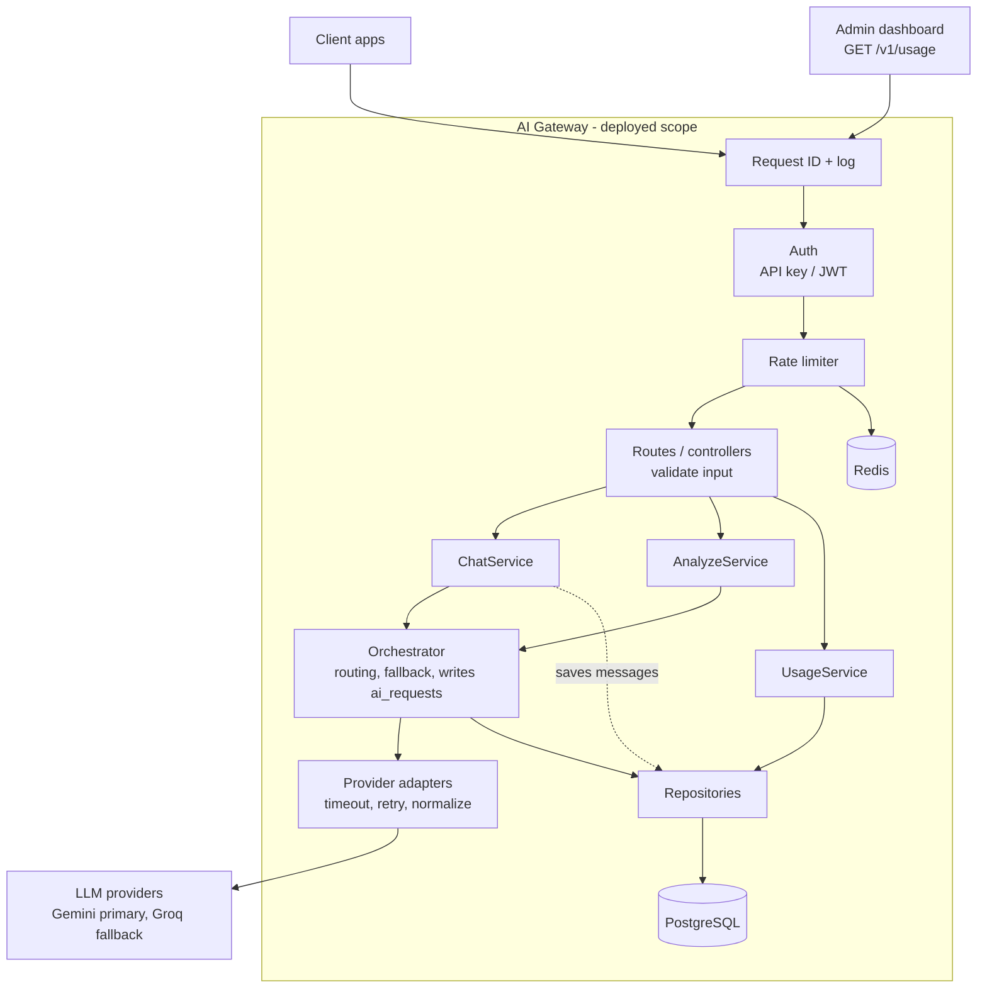

# Architecture

## Component diagram

## Components and code location

| Component                            | Folder                                                    | Responsibility                                             | Must not                  |
| ------------------------------------ | --------------------------------------------------------- | ---------------------------------------------------------- | ------------------------- |
| Request ID + log, Auth, Rate limiter | `src/middleware/`                                         | request_id, access log, identify caller, quota             | contain business logic    |
| Routes / controllers                 | `src/routes/` + `middleware/validate.js` + `src/schemas/` | validate input, call one service, map response             | run SQL or call providers |
| Services                             | `src/services/`                                           | business flow (conversations, tasks, usage)                | call providers directly   |
| Orchestrator                         | `src/llm/orchestrator.js`                                 | choose provider/model, fallback, cost, write `ai_requests` | know about HTTP requests  |
| Provider adapters                    | `src/llm/*.adapter.js`, `retry.js`                        | provider calls, timeout, retry, normalize output           | touch the database        |
| Repositories                         | `src/repositories/`                                       | all SQL (parameterized)                                    | contain business rules    |
| PostgreSQL, Redis                    | `src/infra/`, `migrations/`                               | connections, schema                                        | —                         |

## Request flow — `POST /v1/ai/chat`

1. Middleware assigns `request_id` and starts the access log line.
2. Auth resolves the caller (API key or JWT) → 401 if invalid.
3. Rate limiter checks quota in Redis → 429 if exceeded (not stored in `ai_requests`).
4. Route validates the body → 400 on invalid input.
5. ChatService loads or creates the conversation (404 if not owned), saves the user message in its own transaction, loads the last 20 messages.
6. Orchestrator selects the model; the adapter calls the primary provider with a timeout and retries transient errors.
7. Primary exhausted → fallback provider once.
8. Orchestrator writes one `ai_requests` row (success or error) with tokens, latency, cost, retry_count, is_fallback.
9. Success → ChatService saves the assistant message (linked via `message_id`) and returns 200. Failure → 502/504 in the standard error format.

## Key decisions

- **Stateless gateway**: shared state (rate-limit counters, cache) lives in Redis, so several app instances can run behind a load balancer.
- **Adapter pattern**: adding a provider means adding one adapter; the rest of the code is unchanged. Both providers use the `openai` SDK with SDK retries disabled, so the gateway is the only place that decides retries.
- **Two kinds of logs**: the app log (pino, every request, stdout JSON) and `ai_requests` (AI calls only, source for `/usage`), joined by `request_id`.
- **Middleware order**: logging runs first so even rejected requests (401, 429) leave a trace.
